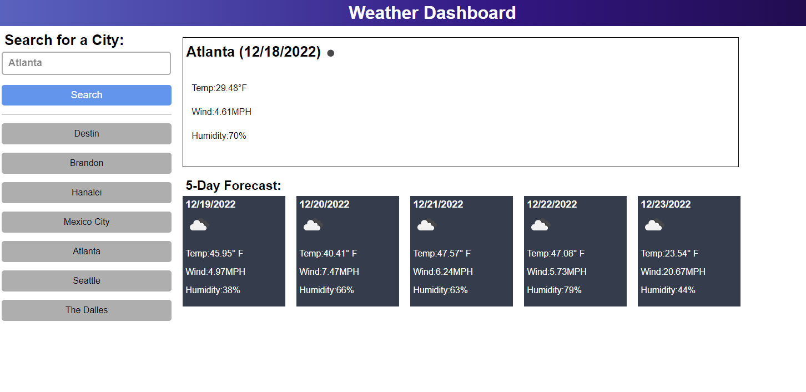

# 🌦️ Weather Dashboard API


## Table of contents
​
- [Description](#description)
- [Overview](#overview)
  - [The Challenge](#the-challenge)
  - [User experience](#user-experience)
  - [Screenshot](#screenshot)
  - [Links](#links)
- [My process](#my-process)
  - [Built with](#built-with)
  - [What I learned](#what-i-learned)
  - [Continued development](#continued-development)
  - [Useful resources](#useful-resources)
- [Author](#author)

​

<br>
<br>

# 📁 Description 
- a weather app that includes a search option, a list of cities, and a five-day forecast and current weather conditions for any city.
​
<br>

## 📝 Overview

### **The Challenge**

​
User Story

- AS A traveler
- I WANT to see the weather outlook for multiple cities
- SO THAT I can plan a trip accordingly

Acceptance Criteria

- GIVEN a weather dashboard with form inputs
- WHEN I search for a city
- THEN I am presented with current and future conditions for that city and that city is added to the search history
- WHEN I view current weather conditions for that city
- THEN I am presented with the city name, the date, an icon representation of weather conditions, the temperature, the humidity, and the wind speed
- WHEN I view future weather conditions for that city
- THEN I am presented with a 5-day forecast that displays the date, an icon representation of weather conditions, the temperature, the wind speed, and the humidity
- WHEN I click on a city in the search history
- THEN I am again presented with current and future conditions for that city

​
### 👤 User Experience

1. Input a city into the search bar.
2. Click the search button.
3. Then curernt and future weather conditions are populated and that city is added to the search history.
4. Click on a city in the search history to be presented with the current and future weather conditions for that city again.
​
### 📷 Screenshot
​

​
​
### 📎 Links
​
- Solution URL: [https://github.com/AveryCaldwell/weather-dashboard-API](https://github.com/AveryCaldwell/weather-dashboard-API)
- Live Site URL: [https://averycaldwell.github.io/weather-dashboard-API/](https://averycaldwell.github.io/weather-dashboard-API/)
​

## 💡 My process
​

### 🔨 Built with
​
- Semantic HTML5 markup
- CSS custom properties
- JavaScript
- Git/Git pages
- ​jQuery
- Server-Side API
​
​
### 🧠 What I learned

 - While working on this project, I learned how to use the API OpenWeatherMap to collect weather data on cities. 
 - I learned how to consolidate code in order to prevent redundant JS and make it easier to re-use code.
 - In regard to localStorage, I now feel more comfrotable accessing saved data and navigating objects in order to get specific info. 

```js
const generateForecastUrl = (lat, lon) => {
  return `https://api.openweathermap.org/data/2.5/forecast?lat=${lat}&lon=${lon}&appid=${weatherKey}&units=imperial`;
};
```
```js
function forecastCards() {
  let forecastDate,
    forecastIcon,
    forecastTemp,
    forecastWind,
    forecastHumidity,
    dayTime;
  for (let i = 1; i < 6; i++) {
    dayTime = 3 + 8 * (i - 1);
    forecastDate = document.getElementById("forecastDate" + i);
    forecastDate.innerHTML = dateObj[i].dateStr;
    forecastIcon = document.getElementById("forecastIcon" + i);
    forecastIcon.src = `http://openweathermap.org/img/wn/${cityForecast.list[dayTime].weather[0].icon}.png`;
    forecastTemp = document.getElementById("forecastTemp" + i);
    forecastTemp.innerHTML = cityForecast.list[dayTime].main.temp;
    forecastWind = document.getElementById("forecastWind" + i);
    forecastWind.innerHTML = cityForecast.list[dayTime].wind.speed;
    forecastHumidity = document.getElementById("forecastHumidity" + i);
    forecastHumidity.innerHTML = cityForecast.list[dayTime].main.humidity;
  }
}
```
```js
function cityDash() {
  // Date
  let currentDay = document.getElementById("currentDay");
  currentDay.innerHTML = cityWeather.name + " (" + dateObj[0].dateStr + ")";
  // Icon
  let currentIcon = document.getElementById("currentIcon");
  currentIcon.src = `http://openweathermap.org/img/wn/${cityWeather.weather[0].icon}.png`;
  // Temp
  let currentTemp = document.getElementById("currentTemp");
  currentTemp.innerHTML = cityWeather.main.temp;
  // Wind
  let currentWind = document.getElementById("currentWind");
  currentWind.innerHTML = cityWeather.wind.speed;
  // Humidity
  let currentHumidity = document.getElementById("currentHumidity");
  currentHumidity.innerHTML = cityWeather.main.humidity;
}
```

​
### 📖 Continued development
​
- I want to further my understanding of `fetch()` method because its an easier, better method of getting asynchronous resourses. I would also like to better understand `template literals` becauase this method provides a simple way to insert expressions and variables into strings.


​
### 📚 Useful resources
​
- [fetch( )](https://developer.mozilla.org/en-US/docs/Web/API/Fetch_API/Using_Fetch/) - This helped me get a better understanding of `fetch()`. It provided thorough explanations and multiple visual examples that made it easier to comprehend. 
- [Template Literals](https://www.w3schools.com/js/js_string_templates.asp) - This is a great guide on learning the many ways of using Template Literals.
- [Emojis](https://github.com/ikatyang/emoji-cheat-sheet#office)
​

​
## ✏️ Author
  Avery Caldwell
- Email: [AveryCaldwell7@gmail.com](AveryCaldwell7@gmail.com)
- LinkedIn: [https://www.linkedin.com/in/averycaldwell/](https://www.linkedin.com/in/averycaldwell/)
- GitHub - [AveryCaldwell](https://github.com/AveryCaldwell)

